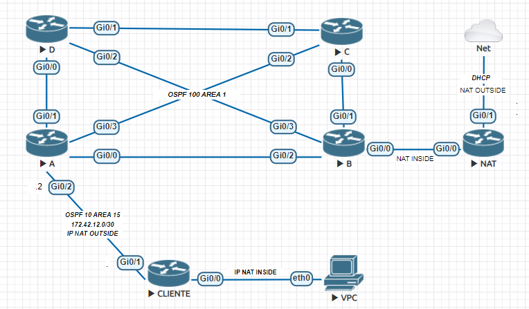

## Visão Geral do Projeto

Este projeto utiliza o EVE-NG para emular um ambiente de rede complexo, que inclui múltiplos roteadores configurados com roteamento dinâmico OSPF (Open Shortest Path First) e NAT (Network Address Translation). O objetivo principal é garantir que a rede interna, composta por vários endereços IP, possa acessar a internet de maneira eficiente através de NAT, enquanto o OSPF gerencia o roteamento dinâmico entre os roteadores.

## Objetivos

1. **Acesso à Internet com NAT**: Configurar o NAT para permitir que a rede 172.168.20.0/24 (Nat interno) atravez do seu endereçamento 172.42.12.1 (nat externo) acesse a internet através de um processo de tradução de endereços IP.
2. **Gerenciamento Dinâmico de Roteamento com OSPF**: Implementar OSPF para garantir o roteamento dinâmico eficiente entre múltiplos roteadores na rede.

## Estrutura da Rede

A rede é composta pelos seguintes dispositivos e suas respectivas configurações:

- **Client**: Responsável pela configuração do NAT e fornecimento de endereços IP para a rede interna através de DHCP.
- **R-NAT**: Gerencia a tradução de endereços internos e fornece uma rota padrão para acessar a internet para simular um ambiente real.
- **R-A**: Realiza a redistribuição de rotas entre os processos OSPF 10 e OSPF 100, conectando diversas sub-redes.
- **R-B**: Anuncia as redes conectadas e participa do OSPF 100.
- **R-C**: Anuncia redes específicas e participa do OSPF 100.
- **R-D**: Gerencia a comunicação entre redes e participa do OSPF 100.

## Configurações Principais

### NAT

As configurações de NAT são implementadas principalmente no **Client** e **R-NAT** para permitir a tradução de endereços IP privados para um endereço público, possibilitando o acesso à internet.

### OSPF

O OSPF é configurado em todos os roteadores para garantir o roteamento dinâmico. O processo OSPF 10 e OSPF 100 são usados para redistribuir rotas e garantir conectividade entre as diferentes partes da rede.

## Configuração dos Roteadores

Cada roteador foi configurado com interfaces específicas e rotas OSPF para garantir uma comunicação eficaz entre as redes. As principais configurações incluem:

- **Client**: Configuração de NAT e DHCP, OSPF 10.
- **R-NAT**: Configuração de NAT, rota padrão e OSPF 100.
- **R-A**: Redistribuição de rotas entre OSPF 10 e OSPF 100.
- **R-B**: Anúncio de redes e OSPF 100.
- **R-C**: Anúncio de redes e OSPF 100.
- **R-D**: Anúncio de redes e OSPF 100.

## Testes e Verificações

- **Verificação de NAT**: Garantir que a rede interna possa acessar a internet.
- **Verificação de OSPF**: Confirmar que todos os roteadores estão formando adjacências e propagando rotas corretamente.

## Conclusão

Este projeto demonstra a capacidade de emular um ambiente de rede complexo utilizando o EVE-NG, com foco em NAT e roteamento dinâmico com OSPF. A configuração foi projetada para garantir que a rede interna tenha acesso eficiente à internet e que o roteamento dinâmico seja gerenciado de forma eficaz.

Para mais detalhes sobre as configurações específicas e scripts, consulte os arquivos de configuração incluídos no repositório `.config`.
